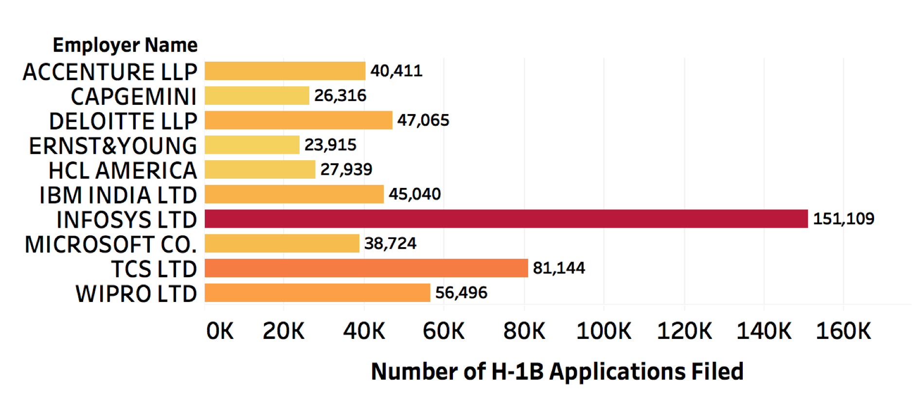
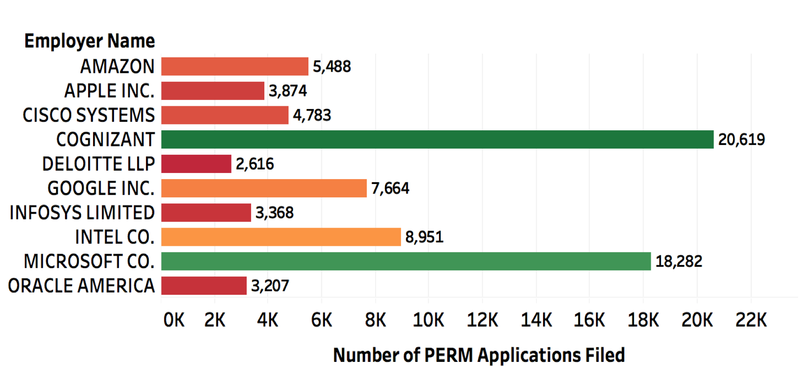
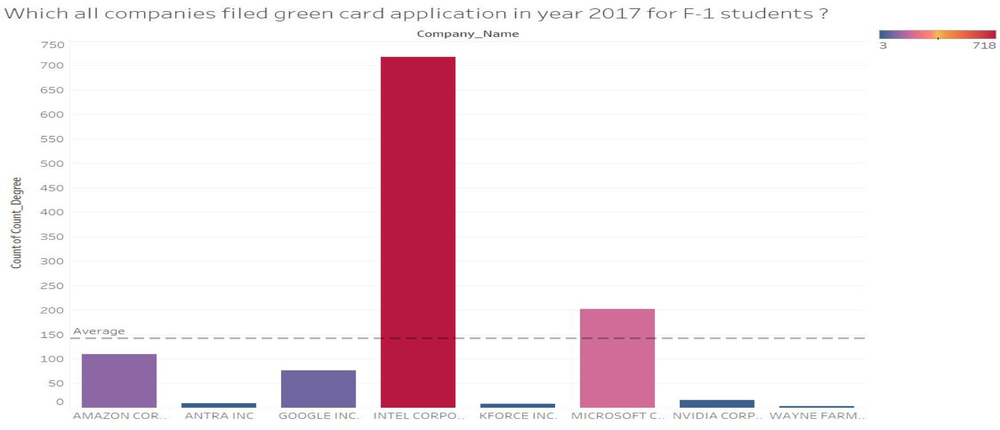
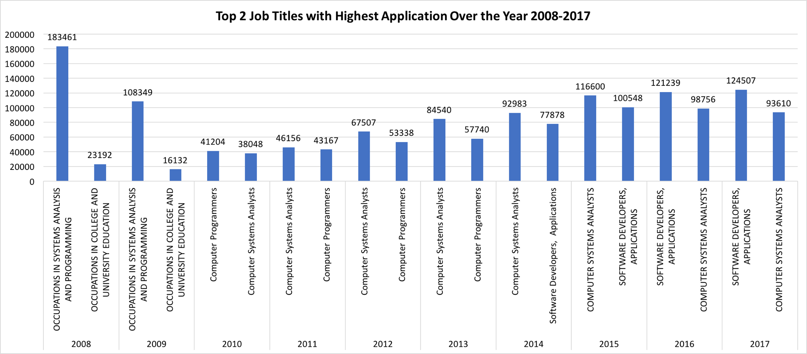
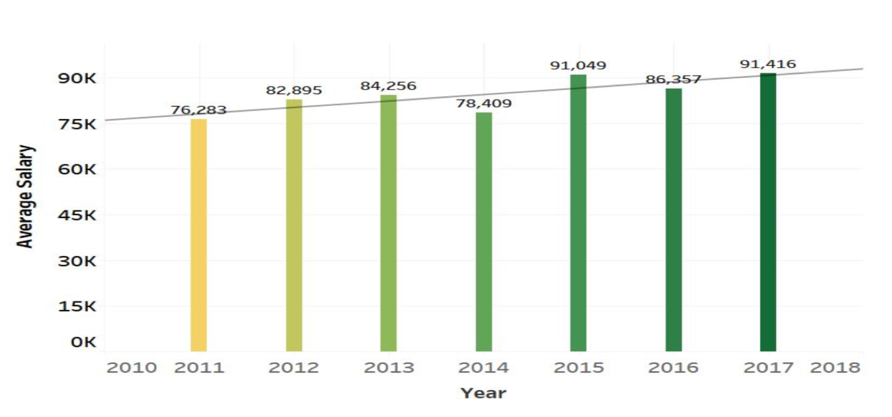
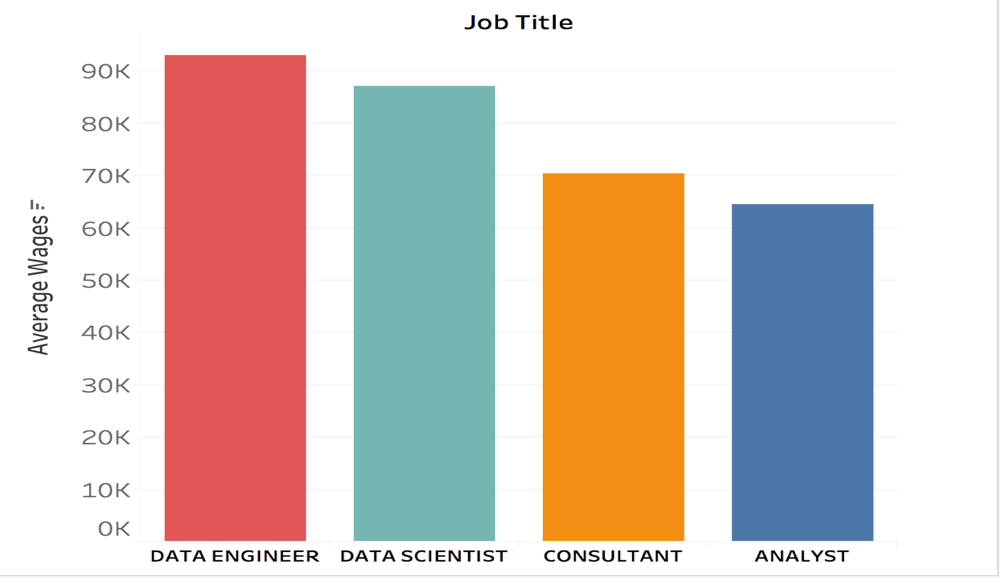
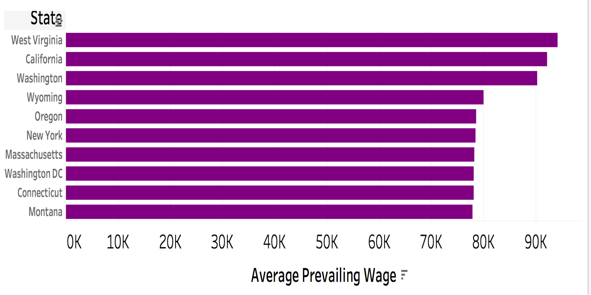

#### Queries and Visualization

###### Index

- [``Number of H-1B applications filed through 2008 to 2017``](#number-of-h1b-applications-filed-through-2008-to-2017)
- [``Top 10 employers to file H-1B``](#top-10-employers-to-file-h1b)
- [``Top 10 employers to file PERM``](#top-10-employers-to-file-green-card-perm)
- [``Top companies who filed green card application in year 2017 for F-1 students``](#top-companies-who-filed-green-card-application-in-year-2017-for-f-1-students)
- [``Top job titles with highest application over the year 2008-2017``](#top-job-titles-with-highest-application-over-the-year-2008-2017)
- [``Average Salary for an analysts position from year 2011 to 2017``](#average-salary-for-an-analysts-position-from-year-2011-to-2017)
- [``Highest Average Salaries Based on Job Titles``](#highest-average-salaries-based-on-job-titles)
- [``Highest Average Salaries Based on Worksite State``](#highest-average-salaries-based-on-worksite-state)

###### Number of H1B applications filed through 2008 to 2017

- Hive Query

 ```sql
 SELECT year, count(*) FROM h1b_data GROUP BY year ORDER BY year;
 ```
 
- Visualization


###### Top 10 Employers to file H1B

- Hive Query

```sql
SELECT employer_name, visa_class, count(employer_name)as count FROM h1b_data WHERE visa_class = 'H-1B' GROUP BY employer_name, visa_class ORDER BY count desc limit 10;
```

- Visualization



###### Top 10 Employers to file Green Card (PERM)

- Hive Query

```sql
SELECT employer_name, count(employer_name)as count FROM perm GROUP BY employer_name ORDER BY count desc limit 10;
```

- Visualization



###### Top companies who filed green card application in year 2017 for F-1 students

- Hive Query

```sql
select Emp_name, Class_of_Admission, Education from perm_data2 where Class_of_Admission = 'F-1';
```

- Visualization



###### Top job titles with highest application over the year 2008-2017

- Hive Query

```sql
SELECT financial_year, job_code, cnt 
FROM 	
(SELECT financial_year, job_code, count(*) as cnt, RANK() 
OVER (PARTITION BY financial_year ORDER BY count(*) DESC) as rnk 
FROM h1b_data GROUP BY financial_year, job_code) as tg 
WHERE rnk=1;
```

- Visualization



###### Average Salary for an analysts position from year 2011 to 2017

- Hive Query

```sql
SELECT  B.YEAR, AVG(B.wage_rate) AS AVG_SALARY FROM pw_2010_17 B
WHERE B.JOB_TITLE LIKE '%Analysts' AND B.VISA_CLASS = 'PERM' 
GROUP BY B.year 
ORDER BY B.year LIMIT 7;
```

- Visualization



###### Highest Average Salaries Based on Job Titles 

- Hive Query

```sql
SELECT B.JOB_TITLE, AVG(B.salary) AS AVG_SALARY FROM H1B B
WHERE B.JOB_TITLE = 'ANALYST' OR B.JOB_TITLE ='DATA SCIENTIST' OR B.JOB_TITLE ='DATA ENGINEER' OR B.JOB_TITLE ='CONSULTANT' AND VISA_CLASS = 'H-1B' AND 
CASE_STATUS = 'CERTIFIED' GROUP BY B.JOB_TITLE
ORDER BY AVG_SALARY DESC 
```

- Visualization



###### Highest Average Salaries Based on Worksite State

- Hive Query

```sql
SELECT B.WORKSITE_STATE, AVG(B.salary) AS AVG_SALARY FROM H1B B
WHERE
VISA_CLASS = 'H-1B' AND 
CASE_STATUS = 'CERTIFIED'
GROUP BY B.WORKSITE_STATE
ORDER BY AVG_SALARY DESC LIMIT 10
```

- Visualization



[](https://www.youtube.com/watch?v=iy3yLLoTTfg?rel=0 "Highest Average Salaries Based on Worksite State")
