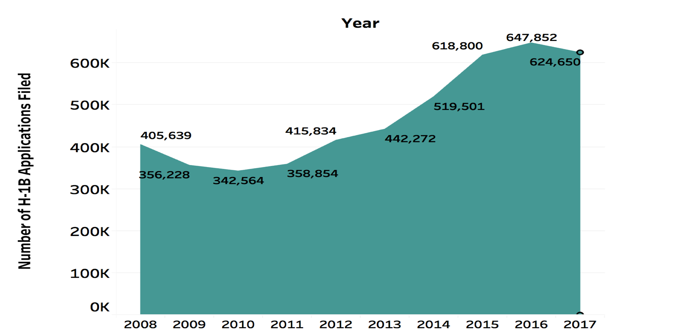
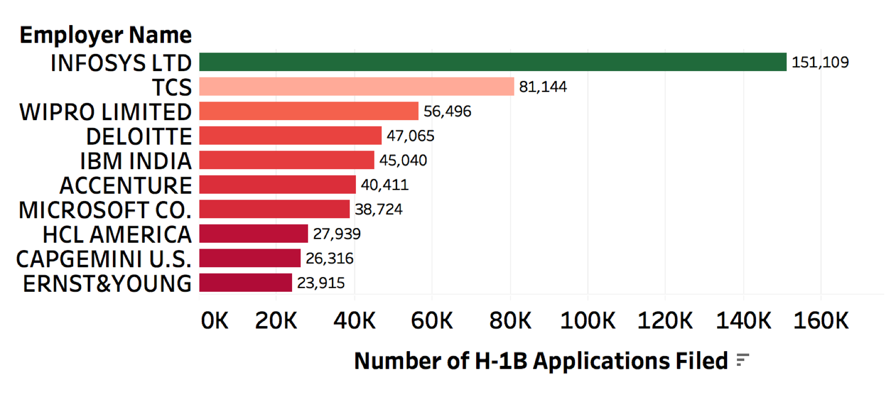
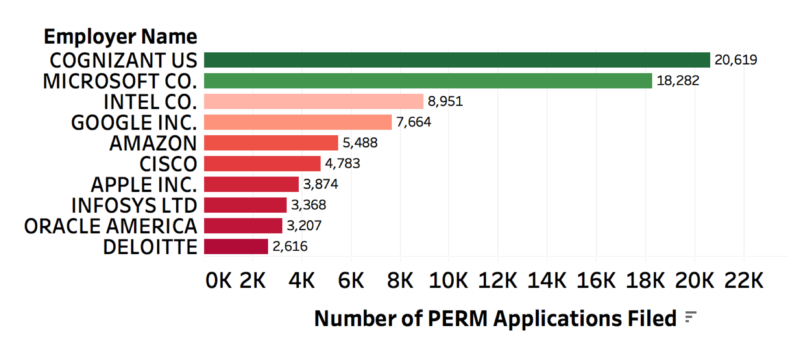

#### Queries and Visualization

###### Index

- [``Number of H-1B applications filed through 2008 to 2017``](#number-of-h1b-applications-filed-through-2008-to-2017)
- [``Top 10 employers to file H-1B``](#top-10-employers-to-file-h1b)
- [``Top 10 employers to file PERM``](#top-10-employers-to-file-green-card-perm)
- [``Top companies who filed green card application in year 2017 for F-1 students``](#top-companies-who-filed-green-card-application-in-year-2017-for-f-1-students)
- [``Top job titles with highest application over the year 2008-2017``](#top-job-titles-with-highest-application-over-the-year-2008-2017)
- [``Average Salary for an analysts position from year 2011 to 2017``](#average-salary-for-an-analysts-position-from-year-2011-to-2017)
- [``Highest Average Salaries Based on Job Titles``](#highest-average-salaries-based-on-job-titles)
- [``Highest Average Salaries Based on Worksite State``](#highest-average-salaries-based-on-worksite-state)

###### Number of H1B applications filed through 2008 to 2017

```sql
CREATE EXTERNAL TABLE IF NOT EXISTS h1b_data_combined(case_number STRING, case_status STRING, case_submitted_date DATE,
decision_date DATE, visa_class STRING, employement_start_date DATE, 
employment_end_date DATE, employer_name STRING, employer_address STRING, 
employer_city STRING, employer_state STRING, employer_postal_code BIGINT, 
designation STRING, job_code STRING, job_title STRING, salary BIGINT,naics_code BIGINT, 
total_workers BIGINT, prevailing_wage BIGINT, wage_unit STRING, 
wage_source STRING, wage_source_yr STRING, wage_source_other STRING, 
worksite_city STRING, worksite_state STRING,
financial_year STRING)
ROW FORMAT SERDE 'org.apache.hadoop.hive.serde2.OpenCSVSerde' 
WITH SERDEPROPERTIES ( "separatorChar" = ",", "quoteChar" = "\"") STORED AS TEXTFILE
TBLPROPERTIES("skip.header.line.count"="1");
```

```sql
CREATE EXTERNAL TABLE IF NOT EXISTS prevailing_wages (case_no string,
visa_class string, emp_name string,
emp_city string, emp_state string,
job_title string,
education_level string, wage_rate double,
wage_unit string, wage_level string, year date)
ROW FORMAT SERDE 'org.apache.hadoop.hive.serde2.OpenCSVSerde'
WITH SERDEPROPERTIES ( "separatorChar" = ",", "quoteChar" = "\"") STORED AS TEXTFILE
TBLPROPERTIES("skip.header.line.count"="1");
```

```sql
CREATE EXTERNAL TABLE IF NOT EXISTS perm_data (emp_name string, 
class_of_admission string, 
education string) 
ROW FORMAT SERDE 'org.apache.hadoop.hive.serde2.OpenCSVSerde'
WITH SERDEPROPERTIES ( "separatorChar" = ",", "quoteChar" = "\"") STORED AS TEXTFILE
TBLPROPERTIES("skip.header.line.count"="1");
```

- Hive Query

 ```sql
 SELECT financial_year, count(*) FROM h1b_data_combined GROUP BY year ORDER BY year;
 ```
 
- Visualization



###### Top 10 Employers to file H1B

- Hive Query

```sql
SELECT employer_name, visa_class, count(employer_name)as count FROM h1b_data_combined WHERE visa_class = 'H-1B' GROUP BY employer_name, visa_class ORDER BY count desc limit 10;
```

- Visualization



###### Top 10 Employers to file Green Card (PERM)

- Hive Query

```sql
SELECT emp_name, count(emp_name)as count FROM perm_data GROUP BY emp_name ORDER BY count desc limit 10;
```

- Visualization



###### Top companies who filed green card application in year 2017 for F-1 students

- Hive Query

```sql
select Emp_name, Class_of_Admission, Education from perm_data where Class_of_Admission = 'F-1';
```

- Visualization


###### Top job titles with highest application over the year 2008-2017

- Hive Query

```sql
SELECT financial_year, job_code, cnt 
FROM 	
(SELECT financial_year, job_code, count(*) as cnt, RANK() 
OVER (PARTITION BY financial_year ORDER BY count(*) DESC) as rnk 
FROM h1b_data_combined GROUP BY financial_year, job_code) as tg 
WHERE rnk=1;
```

- Visualization


###### Average Salary for an analysts position from year 2011 to 2017

- Hive Query

```sql
SELECT B.YEAR, AVG(B.wage_rate) AS AVG_SALARY FROM prevailing_wages B
WHERE B.JOB_TITLE LIKE '%Analysts' AND B.VISA_CLASS = 'PERM' 
GROUP BY B.year 
ORDER BY B.year LIMIT 7;
```

- Visualization


###### Highest Average Salaries Based on Job Titles 

- Hive Query

```sql
SELECT B.JOB_TITLE, AVG(B.salary) AS AVG_SALARY FROM h1b_data_combined B
WHERE B.JOB_TITLE = 'ANALYST' OR B.JOB_TITLE ='DATA SCIENTIST' OR B.JOB_TITLE ='DATA ENGINEER' OR B.JOB_TITLE ='CONSULTANT' AND VISA_CLASS = 'H-1B' AND 
CASE_STATUS = 'CERTIFIED' GROUP BY B.JOB_TITLE
ORDER BY AVG_SALARY DESC 
```

- Visualization


###### Highest Average Salaries Based on Worksite State

- Hive Query

```sql
SELECT B.WORKSITE_STATE, AVG(B.salary) AS AVG_SALARY FROM h1b_data_combined B
WHERE
VISA_CLASS = 'H-1B' AND 
CASE_STATUS = 'CERTIFIED'
GROUP BY B.WORKSITE_STATE
ORDER BY AVG_SALARY DESC LIMIT 10
```

- Visualization


[](https://www.youtube.com/watch?v=iy3yLLoTTfg?rel=0 "Highest Average Salaries Based on Worksite State")
